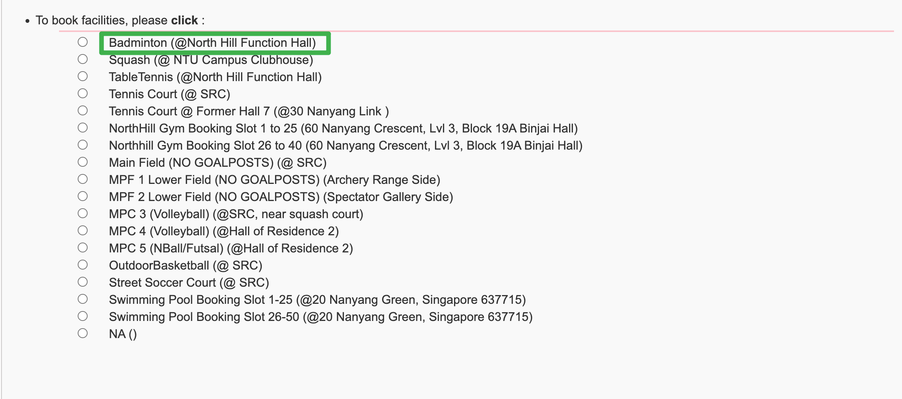
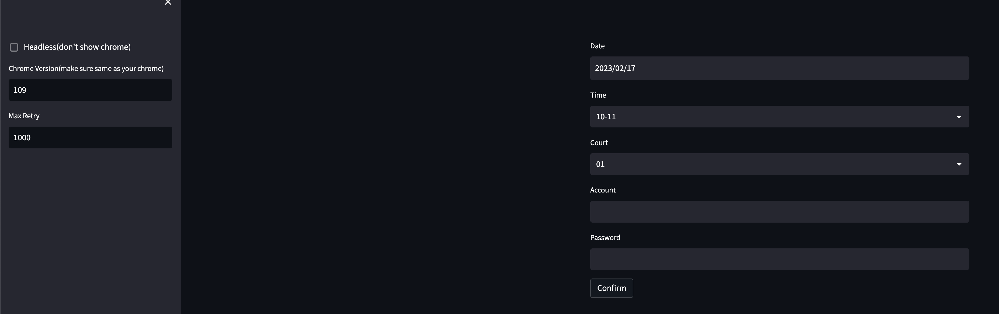

# NTU Badminton Court Crwaler

****Note: Only for educational and technical purposes, not responsible for misuse****

This is a NTU badminton court grabbing assistance software

# TODO
- [X] UI selects the date, time, and court

- [ ] Fix the headless mode doesn't work

# Environment
`pip install -r requirements.txt`

# Usage
`streamlit run ui.py`
